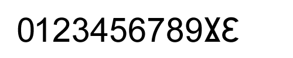

# Why the 'turned 2 and 3' symbols are unacceptable in dozenal system

At the time of writing this, there are two symbols/glyphs that are "supposed" to be used for the number `dek` and the number `el`. Those symbols are sometimes referred to as 'turned 2 and 3' and this is what they look like: 

### [&#8586;](https://www.fileformat.info/info/unicode/char/218a/index.htm) and [&#8587;](https://www.fileformat.info/info/unicode/char/218b/index.htm)

My answer to that is: 

### WRONG!

Both of those symbols look **cheap** and anyone who has even remotely a sense for design and aesthetics will also tell you that those symbols look **butt-ugly**. 

### Cheap-looking and butt-ugly

That's all you need to know about this issue. 

Those two symbols (the 'turned 2 and 3') look cheap and butt-ugly. 

Yes, it's easy to use those things. In HTML you could just use CSS to rotate 2 and 3 by 180 degrees and flip them horizontally etc. but that doesn't mean it's the right thing to do. It's not.

Persuading people to start using a new numeral system on a LARGE scale and getting people in at least one country to switch to dozenal as their **primary numeral system** is an exceptionally difficult task. To have even a remote chance of success with this task you will need to apply many persuasion techniques. The more the better. Cheap-looking glyphs like the "turned 2 and 3" aren't gonna persuade anyone. Such cheap-looking and ugly glyphs are gonna do the opposite of persuasion. That's why it would be a persuasion mistake to keep using those cheap-looking and ugly glyphs. They MUST be replaced with good-looking ones.

Here's my draft for what the numbers `dek` and `el` should approximately look like in Arial font (compared to the other numbers): 

The number el needs a designer's touch because that modified &#400; that I used in the above image isn't completely straight like the other numbers. There needs to be a normal, a bold and an italic version for both numbers (just like with all other numbers). The number el can't always be italic or "half italic".

Both numbers are extremely easy to write for handwriting (a plus for persuasion), extremely easy to spell out and short i.e. "dek" and "el" (another plus for persuasion) and extremely easy to pronounce (yet another plus for persuasion).

The number `dek` has a resemblance with the Roman numeral X (which is very much desirable because that association works in favor of acceptance = a plus for persuasion). And the number `el` resembles a capital E (which makes it seem logical and easy to remember which once again works in favor of acceptance = a plus for persuasion).

Once I have the time for this, I will start creating the dek and el glyphs for EVERY available free font and/or I will find the designers willing to contribute this work or might even hire some designers to do this work.

And once the new, proper dek and el glyphs are available for a large number of free fonts, I will start contacting the owners of proprietary fonts and pointing out that these new glyphs need to be added to their fonts as well.

So, with time, a vastly larger number of fonts (than what's available now, at the time of writing for the ugly versions) will get the proper glyphs for dek and el. Eventually, all fonts will start including these new, good-looking glyphs for dek and el by default.
